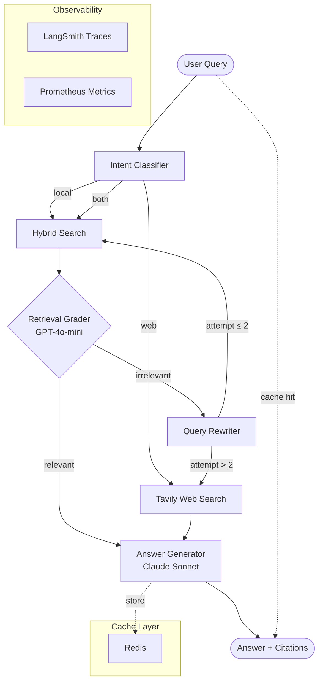

# Agentic RAG with Self-Correction

A production-grade Retrieval-Augmented Generation system where an LLM agent **actively corrects bad retrievals** before generating answers. Built with LangGraph state machines, hybrid search (vector + BM25), and automated evaluation via RAGAS.

---

## Architecture



### Core Loops

| Loop | Purpose |
|------|---------|
| **Retrieval** | Hybrid dense+sparse search with Reciprocal Rank Fusion |
| **Self-Correction** | LLM grades chunks → rewrites query → retries (max 2×) |
| **Multi-Source Routing** | Local Qdrant for docs, Tavily for live web data |

---

## Tech Stack

| Component | Technology |
|-----------|-----------|
| Agent State Machine | LangGraph |
| Vector DB | Qdrant (Docker) |
| Keyword Search | rank-bm25 |
| Embeddings | OpenAI `text-embedding-3-small` |
| Grading LLM | GPT-4o-mini (cheap, fast) |
| Generation LLM | Claude Sonnet 4.6 (accurate) |
| Web Search | Tavily API |
| Caching | Redis |
| API | FastAPI |
| Evaluation | RAGAS (faithfulness, relevance, precision) |
| Observability | LangSmith + Prometheus |

---

## Project Structure

```
agentic-rag/
├── src/
│   ├── agents/
│   │   ├── graph.py          # LangGraph state machine
│   │   ├── nodes.py          # Grade, rewrite, route, generate nodes
│   │   └── tools.py          # Search tools wrapped for agent
│   ├── retrieval/
│   │   ├── hybrid.py         # Dense + sparse + RRF fusion
│   │   ├── vector_store.py   # Qdrant client wrapper
│   │   └── bm25.py           # BM25 keyword search
│   ├── evaluation/
│   │   ├── grader.py         # LLM-as-judge retrieval grader
│   │   └── metrics.py        # RAGAS integration
│   ├── api/
│   │   └── main.py           # FastAPI endpoints
│   ├── cache/
│   │   └── redis_client.py   # Query result caching
│   └── config.py             # Pydantic settings
├── tests/
│   ├── test_retrieval.py
│   └── test_agents.py
├── scripts/
│   ├── ingest_docs.py        # Load documents into Qdrant
│   └── run_evaluation.py     # RAGAS evaluation suite
├── deployment/
│   ├── docker-compose.yml
│   └── Dockerfile
├── docs/
│   └── architecture.md
├── pyproject.toml
└── .env.example
```

---

## Quick Start

### Prerequisites
- Docker & Docker Compose
- Python 3.11+
- [uv](https://docs.astral.sh/uv/) package manager

### 1. Clone and configure

```bash
git clone <repo>
cd agentic-rag
cp .env.example .env
# Fill in OPENAI_API_KEY, ANTHROPIC_API_KEY, TAVILY_API_KEY
```

### 2. Start infrastructure

```bash
docker-compose -f deployment/docker-compose.yml up -d
```

This starts Qdrant (`:6333`) and Redis (`:6379`).

### 3. Install dependencies

```bash
uv venv
source .venv/bin/activate
uv pip install -e ".[dev]"
```

### 4. Ingest documents

```bash
python scripts/ingest_docs.py --source ./data/docs
```

### 5. Run the API

```bash
uvicorn src.api.main:app --reload --port 8000
```

### 6. Query it

```bash
curl -X POST http://localhost:8000/query \
  -H "Content-Type: application/json" \
  -d '{"query": "What is Retrieval-Augmented Generation?", "source": "auto"}'
```

---

## API Reference

### `POST /query`

```json
{
  "query": "string",
  "source": "local | web | auto",
  "top_k": 5
}
```

**Response:**
```json
{
  "answer": "string",
  "sources": ["url or doc_id"],
  "rewrite_attempts": 0,
  "used_web_fallback": false,
  "latency_ms": 342,
  "cached": false
}
```

### `POST /ingest`

```json
{
  "documents": [{"text": "...", "metadata": {"source": "..."}}]
}
```

### `GET /health`

```json
{"status": "ok", "qdrant": "up", "redis": "up"}
```

### `GET /metrics`

Prometheus metrics endpoint.

---

## Evaluation

Run the RAGAS evaluation suite:

```bash
python scripts/run_evaluation.py --dataset tests/eval_dataset.json
```

**Metrics produced:**

| Metric | Description |
|--------|-------------|
| `faithfulness` | Are claims grounded in retrieved context? |
| `answer_relevancy` | Does the answer address the question? |
| `context_precision` | Are retrieved chunks actually useful? |
| `context_recall` | Were all necessary chunks retrieved? |

Results saved to `evaluation_results/` as JSON + HTML report.

---

## Observability

- **LangSmith**: Set `LANGCHAIN_TRACING_V2=true` — every agent decision is traced
- **Prometheus**: Metrics at `:9090/metrics` — latency, token usage, cache hit rate, rewrite counts
- **Structured logs**: JSON via `structlog`, parseable by any log aggregator

---

## Performance Numbers

*(measured on sample 100-doc corpus)*

| Metric | Value |
|--------|-------|
| P50 latency | ~340ms |
| P95 latency | ~1.2s |
| Cache hit rate | ~35% on repeated queries |
| Faithfulness score | 0.91 |
| Answer relevancy | 0.88 |
| Cost per query (no cache) | ~$0.004 |

---

## One-Command Deploy

```bash
docker-compose -f deployment/docker-compose.yml up --build
```

Starts: Qdrant + Redis + FastAPI app on `:8000`

---

## License

MIT
